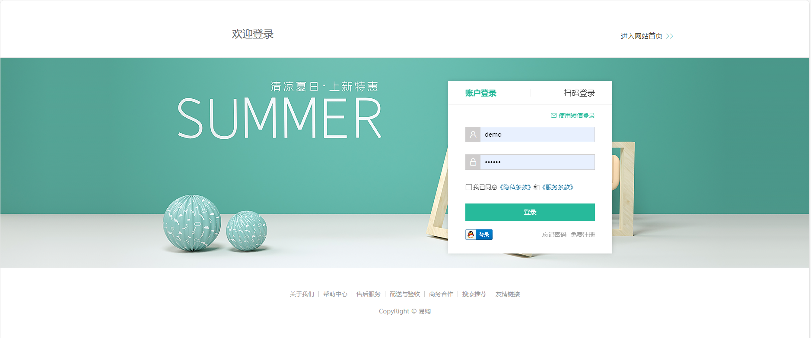

# YIGOU-project
易购商城是一个综合品类电商平台。实现购物车，商品查看，订单管理，支付等功能。

## 功能细节介绍：

- 首页模块：顶部通栏，吸顶导航，网站头部，左侧分类，轮播图，新鲜好物，人气推荐，热门品牌，分类商品推荐，专题推荐，网站底部。

- 一级分类：面包屑，轮播图，全部二级分类，二级分类推荐商品。

- 二级分类：筛选区域，排序功能，商品列表，无限加载。

- 商品详情：商品图片及基本信息展示，配送城市选择，商品详情展示，评价展示，加入购物车。

- 购物车：

  头部购物车：展示商品数量和列表，删除商品，跳转购物车页面。

  购物车页面：购物车商品展示，选择商品，修改数量，修改商品规格，价格计算，跳转下单

- 登录模块：表单校验，账户密码登录，第三方登录。

- 填写订单：订单商品展示，收货地址选择，收货地址修改，支付方式选择，生成订单。

- 支付：订单信息展示，跳转支付网关，提示正在支付，等待支付结果，跳转支付成功页面。

- 个人中心：个人信息，收藏商品，近期足迹，猜你喜欢

- 订单管理：全部订单，订单筛选。管理操作: 付款，取消，确认收货，删除，查看物流。

- 订单详情：订单状态，详细信息。

## 项目运行
```
npm install
```

##### 编译及热重载
```
npm run serve
```

##### 项目打包
```
npm run build
```

## 工程结构解析

```
├── dist                       # 打包文件夹（可删除重新打包）
├── src                        # 源代码
│   ├── assets                 # 静态资源
│   ├── components             # 全局组件
│   ├── hooks                  # 全局函数  
│   ├── router                 # 路由配置
│   └── store                  # vuex状态管理
│       └── modules             # 各模块相关状态
│   └── views                  # 主包页面
│       ├── cart                # 购物车
│       ├── category            # 分类
│       ├── goods               # 商品
│       ├── home                # 首页
│       ├── member              # 会员中心
│       └── login            	# 登录
│   ├── utils                  # 通用工具类
│   ├── App.vue                # 入口页面
│   └── main.js                # Vue初始化入口文件
├── .editorconfig              # editorconfig 配置
├── .eslintrc.cjs              # eslint 配置
├── .gitignore                 # git 忽略文件
├── package.json               # package.json 依赖
└── vite.config.ts             # vite 配置
```

# 部分页面截取


### 登录界面

